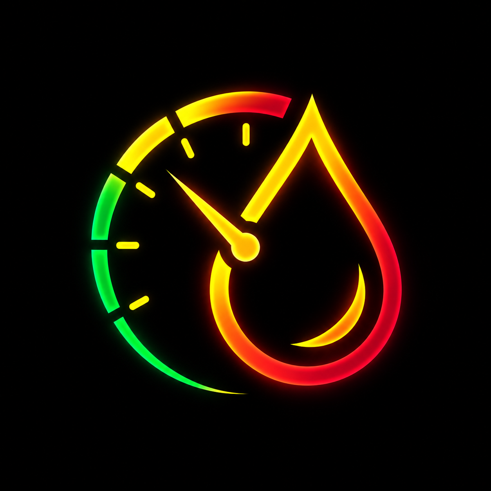

<p align="center">
  
</p>

# ⛽ FuelMate 2.0 — Vehicle Fuel & Expense Tracker

[](https://developer.apple.com/ios/)
[](https://swift.org)
[](https://developer.apple.com/xcode/swiftui/)
[](https://developer.apple.com/documentation/coredata)
[](https://developer.apple.com/documentation/charts)
[](https://developer.apple.com/documentation/vision)
[](https://developer.apple.com/documentation/mapkit)
[](LICENSE)

**FuelMate 2.0** is an enterprise-grade iOS automotive tracking application designed with **SwiftUI, Swift Charts, Core Data, MapKit, and Apple's Vision framework**. Tailored for high-accuracy fuel consumption monitoring, FuelMate 2.0 provides dual City/Highway baseline benchmarking, live Sri Lankan market fuel pricing, bi-directional auto-calculations, on-device thermal receipt scanning, and GPS station mapping.

---

## 🌟 Key Features

### 🚘 1. Multi-Vehicle Fleet Management & Dual Baselines
* **Fleet Support**: Track and manage multiple vehicles (*Cars, Motorcycles, SUVs, Vans, Three-Wheelers*).
* **Dual Consumption Baselines**:
  * **Target City Fuel Consumption (km/L)**: Baseline for urban driving with stop-and-go traffic.
  * **Target Highway Fuel Consumption (km/L)**: Baseline for highway, expressway, and intercity cruising.
* **Inline Strict Validations**: Enforces `.keyboardType(.decimalPad)` inputs with strict inline validation ensuring both baseline values are $> 0\text{ km/L}$ before saving.
* **One-Tap Switcher**: Instant vehicle switching across Dashboard, History, Analytics, and Settings.
* **Safe Core Data Migration**: Pre-configured lightweight migration with resilient default fallbacks (`10.0` km/L city, `15.0` km/L highway) preventing runtime crashes.

### ⛽ 2. Dynamic Fuel Price Engine (`FuelPriceManager`)
* **Live Market Rates (LKR/L)**: `@AppStorage`-backed dynamic fuel pricing for Sri Lankan fuel varieties:
  1. `Petrol Octane 92` (Default: Rs. 414.00)
  2. `Petrol Octane 95 (Premium)` (Default: Rs. 450.00)
  2.2 `Petrol Octane 95 (Euro 4)` (Default: Rs. 440.00)
  3. `Petrol XtraPremium Euro 3` (Default: Rs. 445.00)
  4. `Lanka Auto Diesel` (Default: Rs. 392.00)
  5. `Lanka Super Diesel 4 Star (Euro 4)` (Default: Rs. 435.00)
* **Editable Settings Section**: Dedicated *"Current Fuel Prices (LKR/L)"* section in Settings with editable decimal fields and one-tap restore to market defaults.
* **Automatic Rate Sync**: Modifying rates in Settings immediately updates unit price auto-calculations when recording fuel logs.

### 🧾 3. On-Device Receipt OCR Scanner (Apple Vision)
* **Native Vision Framework (`VNRecognizeTextRequest`)**: 100% private, on-device text recognition with zero third-party or paid cloud APIs.
* **Thermal Fuel Receipt Optimization**:
  * **Station Brand Extraction**: Automatic recognition for **CEYPETCO**, **LANKA IOC**, **SINOPEC**, and **SHELL / RM PARKS**.
  * **Total Amount / Cost**: Pattern matcher extracting values from lines containing `TOTAL`, `AMOUNT`, `NET`, `RS.`, `LKR`, `CASH`, `CARD`.
  * **Volume (Liters)**: Heuristic regex parser identifying quantities tagged with `QTY`, `VOL`, `LTR`, `LITRES`, `L`.
  * **Fuel Grade Classification**: Categorizes Octane 92, Octane 95, Auto Diesel, Super Diesel.
* **Dual Input Modes**: Native Camera sheet (`UIImagePickerController`) and Photos Picker (`PhotosPickerItem`) with HUD scanline animations.
* **Seamless Review Transition**: Scanned metrics directly prefill `AddLogView` for user verification prior to persistence.

### 🗺️ 4. Native MapKit Station Locator & Pin Selection
* **MapKit Natural Language Search (`MKLocalSearch`)**: Search for fuel sheds and petrol stations near GPS coordinates or via natural language queries (*e.g., "Ceypetco", "petrol shed", "LIOC"*).
* **Interactive Map Sheet (`StationPickerMapView`)**: Tap station markers or drop custom pins to capture station names, localities, and GPS coordinates.
* **Auto-Populate Integration**: Confirming a station pin automatically injects the station brand, coordinates, and locality into the fill-up log.
* **Sri Lankan Brand Styling**: Color-coded station markers (*Ceypetco Blue, Lanka IOC Orange, Sinopec Crimson, Shell Gold*).

### 📊 5. Executive Dashboard & Circular Benchmarking Gauge
* **Animated Circular Gauge with Dual Target Markers**:
  * Displays real calculated fuel economy in km/L (or MPG).
  * Renders two distinct target marker lines directly on the ring:
    * 🟧 **City Target Marker Line**: Visual marker indicating vehicle's baseline city threshold.
    * 🟩 **Highway Target Marker Line**: Visual marker indicating vehicle's highway cruising threshold.
  * Dynamically animates the actual efficiency arc, color-shifting from Amber (below city target), to Cyan/Blue (within baseline range), to Emerald Green (exceeding highway target).
  * **Division-by-Zero Safety**: Gracefully displays `"No logs yet"` when fewer than 2 logs exist.
* **Responsive 2x2 KPI Grid**:
  * **Total Spent**: Cumulative fuel expenditure in active currency (*e.g., Rs. 24,500.00*).
  * **Tracked Distance**: Net odometer span for the selected vehicle.
  * **Average Fuel Price**: Unit fuel price per liter.
  * **Operating Cost / Distance**: Operating cost per kilometer or mile.
* **Sparkline Trajectory**: Catmull-Rom smoothed spline displaying recent fuel economy directly on the dashboard.

### 📝 6. Smart Fill-Up Logging (`AddLogView`)
* **Driving Condition Selector**: Segmented picker categorizing the tank's driving condition:
  * 🏙️ **City**: Urban commute benchmarked against City Target.
  * 🛣️ **Highway**: Expressway run benchmarked against Highway Target.
  * 🔄 **Mixed**: Combined cycle benchmarked against the weighted average.
* **Sri Lankan Fuel Varieties Selector**: Dropdown menu selecting the 5 exact Sri Lankan market grades.
* **Bi-Directional Auto-Calculation**:
  * Auto-fetches unit price from `FuelPriceManager` based on selected fuel grade.
  * When **Volume** is entered, auto-calculates `Total Cost = volume * unitPrice`.
  * When **Total Cost** is entered, auto-calculates `Volume = totalCost / unitPrice`.
  * Changing fuel grade recalculates total cost automatically without recursive feedback loops.
* **Strict Validation Engine**: Save button disabled until `odometer > 0`, `volume > 0`, and `totalCost > 0`. Displays inline red text if the odometer is 0 or less than the previous recorded odometer reading.

### 📈 7. Deep Analytics & Swift Charts
* **Interactive Touch Scrubbing**: Drag across curves to inspect date, economy, and station with haptic feedback.
* **Catmull-Rom Fuel Economy Spline**: Continuous curved trajectory with dynamic baseline rule marks.
* **Monthly Expense Bar Chart**: Visualizes month-over-month fuel expenditures with annotated totals.
* **Time-Range Filters**: Filter charts across `30 Days`, `6 Months`, `1 Year`, and `All Time`.
* **Vehicle Insights Grid**: Peak economy, lowest economy, average fill-up cost, and cruise cost per 100 km.

### 🗂️ 8. Searchable History & Detailed Inspection
* **Trip Condition Badges**: Each history row displays a color-coded capsule badge (`City`, `Highway`, `Mixed`).
* **Monthly Chronological Grouping**: Logs grouped by month/year with expense and volume summaries.
* **Brand Filter Carousel**: Quick filters for Ceypetco, Lanka IOC, Sinopec, Shell / RM Parks.
* **Full-Text Search**: Search by station, city, fuel grade, or driving notes.
* **Log Detail View**: Embedded MapKit view displaying station GPS coordinates, unit price, and trip condition metric tile.
* **RFC-4180 CSV Export**: Standard CSV export compatible with Excel, Numbers, and Google Sheets.

---

## 🛠️ Architecture & Technology Stack

```
FuelMate/
├── FuelMateApp.swift                    # App Entry Point & Core Data viewContext injection
├── MainTabView.swift                    # 4-Tab Navigation (Dashboard, History, Analytics, Settings)
├── Theme.swift                          # Semantic Design System, Sri Lankan Constants, TripCondition enum
├── Services & Persistence/
│   ├── PersistenceController.swift      # Programmatic Core Data (Vehicle dual baselines, FuelLog tripType)
│   ├── FuelPriceManager.swift           # @AppStorage Dynamic Sri Lankan Fuel Price Engine
│   ├── ReceiptScannerService.swift      # Apple Vision Framework OCR & Thermal Receipt Parser
│   ├── StationSearchService.swift       # MapKit MKLocalSearch Natural Language Locator
│   ├── LocationManager.swift            # CoreLocation GPS Geocoding Provider
│   └── UnitSettings.swift               # Localization, Currency, and RFC-4180 CSV Export
├── ViewModels/
│   └── FuelLogViewModel.swift           # @MainActor State, Validations, Fleet Operations & Seeding
└── Views/
    ├── DashboardView.swift              # Circular Gauge with City/Hwy Markers, KPI Grid
    ├── AddLogView.swift                 # Trip Type Segmented Picker, Smart Auto-Calc, Validations
    ├── ReceiptScannerView.swift         # Camera & PhotosPicker, Laser HUD, OCR Handoff
    ├── StationPickerMapView.swift       # MapKit Search & Pin Auto-Populate Sheet
    ├── AnalyticsView.swift              # Swift Charts Catmull-Rom Splines with Touch Scrubbing
    ├── HistoryView.swift                # Searchable Monthly Log List, Trip Badges & LogDetailView
    └── VehicleManagementView.swift      # Dual Baseline Vehicle Editor & Fleet Management
```

---

## 🧪 Unit & Integration Test Suite

The test suite validates Core Data programmatic entities, dynamic pricing lookups, dual vehicle consumption baselines, odometer regression guards, and station search:

```bash
DEVELOPER_DIR=/path/to/Xcode.app/Contents/Developer xcrun xcodebuild test \
  -scheme FuelMate \
  -destination 'platform=iOS Simulator,name=iPhone 15' \
  -only-testing:FuelMateTests
```

**Results**:
```
Test suite 'FuelMateTests' started
Test case 'FuelMateTests.testFuelPriceManagerLookups()' passed (0.089s)
Test case 'FuelMateTests.testMultiVehicleManagement()' passed (0.350s)
Test case 'FuelMateTests.testNegativeOrZeroMetricsThrowError()' passed (0.012s)
Test case 'FuelMateTests.testOdometerRegressionThrowsError()' passed (0.023s)
Test case 'FuelMateTests.testSeedSriLankanDemoData()' passed (0.056s)
Test case 'FuelMateTests.testStationBrandDetection()' passed (0.270s)
Test case 'FuelMateTests.testVehicleAndFuelLogRelationship()' passed (0.012s)

** TEST SUCCEEDED **
```

---

## 📱 System Requirements
- **iOS 17.2+**
- **Xcode 15.2+**
- **Swift 5.9+**
- Architecture: 100% Native Apple frameworks (`SwiftUI`, `Core Data`, `Swift Charts`, `Vision`, `MapKit`).
- Adaptive UI: Complete native support for **Light Mode** and **Dark Mode** utilizing Apple semantic system tokens.
